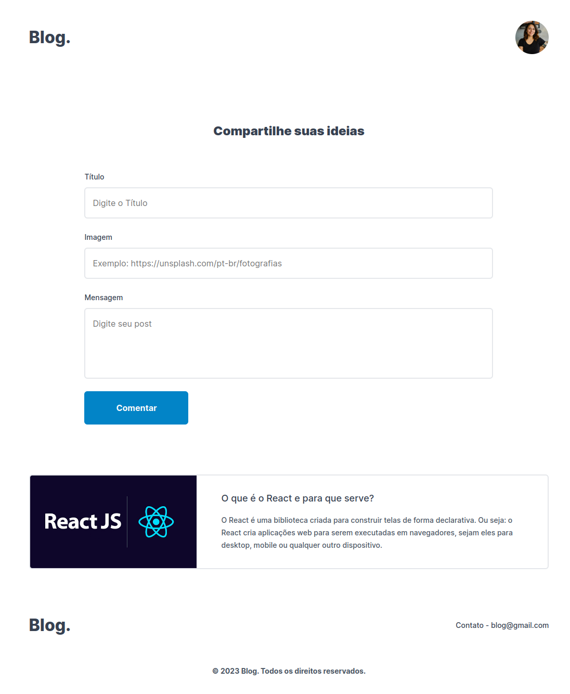

  <h1 align="center">Blog javascript</h1>

  

    <a href="#-projeto">Projeto</a>&nbsp;&nbsp;&nbsp;|&nbsp;&nbsp;&nbsp;
    <a href="#-tecnologias">Tecnologias</a>&nbsp;&nbsp;&nbsp;|&nbsp;&nbsp;&nbsp;
    <a href="#-como-rodar-projeto">Como rodar projeto</a>&nbsp;&nbsp;&nbsp;|&nbsp;&nbsp;&nbsp;
    <a href="#-licença">Licença</a>
  

  

    
  

## 📋 Projeto

  

    Trabalhar com o DOM foi uma parte crucial do processo, pois me permitiu acessar e modificar elementos HTML de maneira eficaz, garantindo que o conteúdo do blog seja exibido de maneira atraente e responsiva em diferentes dispositivos. Em resumo, este projeto foi uma oportunidade valiosa para aprimorar minhas habilidades em programação e desenvolvimento web.
  

  

## 👨🏻‍💻 Tecnologias

    Abaixo as tecnologias que utilizamos para o desenvolvimento do projeto:

    > Frontend
    1 - Javascript
    2 - HTML
    3 - CSS

  

<a href="https://blog-phi-two-73.vercel.app/" target="_blank">Clique e veja projeto online</a>

## 📝 Licença

Este projeto está licenciado com a licença [MIT](https://github.com/brunogoncalvesferreira/blog/blob/main/LICENSE).

  <h2>🙋🏻‍♂️ Entre em contato<h2>
  

    
     
    
  

